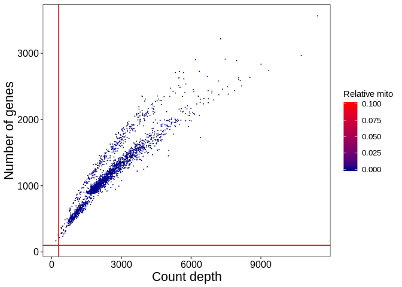
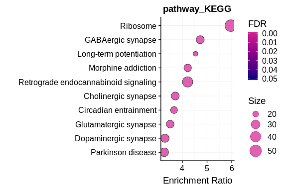
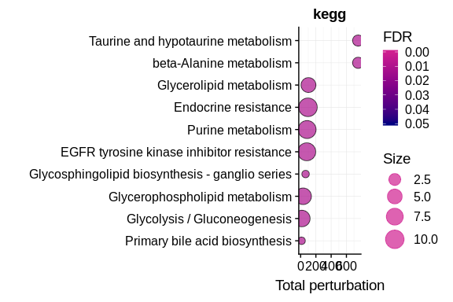

<!-- README.md is generated from README.Rmd. Please edit that file -->
scFlow
======

<!-- badges: start -->
[](https://travis-ci.org/combiz/scFlow)
[](https://codecov.io/gh/combiz/scFlow?branch=master)
[](https://ci.appveyor.com/project/combiz/scFlow)
<!-- badges: end -->

The goal of scFlow is to provide tools in R to build a complete analysis
workflow for single-cell/nuclei RNA sequencing data.

-   Quality control of gene-cell matrices
    -   Filtering of matrices by counts and features
    -   Filtering of mitochondrial genes and mitochondrial counts
        thresholding
    -   Doublet and multiplet identification and removal with
        [DoubletFinder](https://github.com/chris-mcginnis-ucsf/DoubletFinder)
    -   Rich QC metrics annotation with
        [scater](https://github.com/davismcc/scater)
-   Dimensionality reduction and celltype identification
    -   Louvain clustering, UMAP dimensionality reduction, and cluster
        marker gene identification with
        [monocle](https://github.com/cole-trapnell-lab/monocle-release)
    -   Celltype annotation with
        [EWCE](https://github.com/NathanSkene/EWCE) and
        [Liger](https://github.com/MacoskoLab/liger)
    -   Cluster identity mapping against the [Allen Human Brain
        Atlas](https://www.brain-map.org) and Mouse Nervous System Data
        from [Zeisel 2018](https://doi.org/10.1016/j.cell.2018.06.021)
-   Differential gene expression implementations
    -   Zero-inflated regression model with
        [MAST](https://github.com/RGLab/MAST)
    -   Random effects model with [Limma](https://github.com/cran/limma)
    -   Negative binomial distribution pseudobulking model with
        [DESeq2](https://github.com/mikelove/DESeq2)
    -   Pseudobulk generalized likelihood ratio tests with
        [EdgeR](https://github.com/StoreyLab/edge)
-   Pathway and functional category enrichment analysis
    -   Interface to the Enrichr database with
        [EnrichR](https://github.com/cran/enrichR)
    -   Interface to the WebGestalt tool with
        [WebGestaltR](http://www.webgestalt.org/)
-   Publication quality plots and analysis reports
    -   QC plots and tabular metrics suitable for reports.
    -   UMAP plots for cell features and gene expression.
    -   Violin plots for gene expression.
    -   Pathway and gene enrichment plots

The package functions are designed to interface neatly with
[NextFlow](https://www.nextflow.io/) for scalable and containerized
pipelines deployed locally, on high-performance computing clusters, or
in the cloud. An accompanying NextFlow pipeline is in the works - TBA.

Installation
------------

You must have hdf5 setup on your system to run this. If using linux, run
“sudo apt-get install libhdf5-dev”.

You can install the development version of scFlow from
[GitHub](https://github.com/) with:

``` r
# install.packages("devtools")
devtools::install_github("combiz/scFlow")
```

An additional data package `scFlowData` will be needed which contains
supplimentary data required for gene annotaion, cell type annotation,
pathway analysis. Install that with:

``` r
# install.packages("devtools")
devtools::install_github("combiz/scFlowData")
```

Developers
----------

You may need to install scFlow using a Personal Access Token
(Github-&gt;Settings-&gt;Developer Settings): -

``` r
# install.packages("devtools")
devtools::install_github("combiz/scFlow", auth_token = "YOURTOKEN")
```

See [this page on the
wiki](https://github.com/combiz/scFlow/wiki/Installing-scFlow-from-a-private-github-repo)
for a full explanation. For dependecy related issues check this
[link](https://github.com/combiz/scFlow/wiki).

Preprocessing example dataset
-----------------------------

### Prerequisite

To preprocess scFlowExamples dataset, the following packages should be
installed.

``` r
if (!requireNamespace("BiocManager", quietly = TRUE)) {
  install.packages("BiocManager")
}
BiocManager::install("DropletUtils")

install.packages("ids")

devtools::install_github("NathanSkene/One2One")
```

### Install the dataset repository

``` r
devtools::install_github("neurogenomics/scFlowExample")
```

### Preparing data for *scFlow*

``` r
library(scFlowExamples)
indvExp <- scFlowExamples::indvExp

# Create a folder to store the 10xGenomics matrix format data
output_path <- "~/tmp_ZeiselSCFLOW"
dir.create(output_path)


for (i in 1:length(indvExp)) {
  x <- indvExp[[i]]$exp
  
  # Convert gene symbols from mouse to human
  # Limit genes to Mouse:Human orthologs
  # Convert human gene symbols to Ensembl gene IDs
  
  x <- mouse_symbol_to_human_ensembl(x)
  
  # Write the data

  output_file <- sprintf("%s/individual_%s", output_path, i)
  DropletUtils::write10xCounts(output_file, x,
    barcodes = colnames(x), gene.id = rownames(x),
    gene.symbol = rownames(x), gene.type = "Gene Expression", overwrite = TRUE,
    type = "auto", genome = "unknown", version = "3"
  )
}
```

### Create the manifesto file for *scFlow*

``` r
y <- ids::proquint(n = length(indvExp), n_words = 1L, use_cache = TRUE, use_openssl = FALSE)
z <- data.frame(key = y, filepath = sprintf("%s/%s", output_path, list.files(output_path, pattern = "individual")), stringsAsFactors = FALSE)
write.table(z, file = sprintf("%s/Manifest.txt", output_path), row.names = FALSE, col.names = TRUE, quote = FALSE, sep = "\t")
```

### Create the sample sheet for *scFlow*

``` r
dx <- unlist(lapply(indvExp, FUN = function(x) {
  return(x$dx)
}))
sex <- sample(c("M", "F"), length(dx), replace = T)
age <- sample(1:100, length(dx))
sample_sheet <- cbind(manifest = z[, 1], individual = rownames(z), diagnosis = dx, sex = sex)
write.table(sample_sheet, file = sprintf("%s/SampleSheet.tsv", output_path), row.names = FALSE, col.names = TRUE, quote = FALSE, sep = "\t")
```

For a detailed explanation on how `scFlowExample` dataset was generated,
visit this [link](https://github.com/neurogenomics/scFlowExample).

Running *scFlow*
----------------

The `scFlow` pipeline requires three main input: a folder containing
`matrix.mtx.gz`, `features.tsv.gz`, `barcodes.tsv.gz` for individual
samples, a SampleSheet.tsv file which is a tab-separated-variable file
with sample metadata and a Manifest.txt file is a tab-separated-variable
file with two columns: `key` and `filepath`. Details of how to generate
the files is given in this
[page](https://github.com/combiz/scFlow/wiki/Generating-a-Manifest-File-and-SampleSheet-for-scFlow)

The basic `scFlow` workflow for sample QC begins with the import of the
feature-barcode sparse matrix with `read_sparse_matrix`. The metadata
for the sample is then imported from a sample sheet with
`read_metadata`. A SingleCellExperiment object is created from the
matrix and the metadata using `generate_sce` which is then annotated
with both gene and cell-level data using `annotate_sce`. We then filter
the SingleCellExperiment to select only cells and genes meeting our QC
criteria using `filter_sce`. We can then optionally find singlets in our
filtered SingleCellExperiment using `find_singlets` before filtering
them out again with `filter_sce`. A complete QC report can then be
generated using `report_qc_sce` before saving the filtered and
quality-controlled SingleCellExperiment with `write_sce`.

### Step one - import the matrix and metadata

``` r
matrix_fp <- "path/to/matrix/file"
samplesheet_fp <- "path/to/SampleSheet.tsv"
ensembl_fp <- paste(system.file("extdata", package = "scFlowData"), "/", "ensembl_mappings.tsv", sep = "")
```

``` r
library(scFlow)
mat <- read_sparse_matrix(matrix_fp)
```

Next we retrieve the metadata by pointing to a Sample Sheet and
specifying a unique identifier (unique\_key) in a specific column
(key\_colname):

``` r
metadata <- read_metadata(
unique_key = "fonij",
key_colname = "manifest",
samplesheet_path = samplesheet_fp
)
#> ══ Retrieving sample metadata ════════════════════════════════════════════════════════════════════════════════════ 
#> Reading /home/nfancy/R/x86_64-pc-linux-gnu-library/3.6/scFlowData/extdata/vignette_data/SampleSheet.tsv  
#> ✔ Four metadata variables loaded for manifest='fonij'
#> manifest: fonij (factor)
#> individual: 1 (integer)
#> diagnosis: Cases (factor)
#> sex: F (factor)
```

For downstream analyses it’s important that the variable classes are
correctly specified. Carefully inspect the metadata classes in brackets.
In the above example we see that the *individual* were imported as
integer rather than factor variables. Let’s correct this by reloading
the metadata, this time specifying the correct variable classes for this
variable:-

``` r
var_classes <- c(
individual = "factor"
)

metadata <- read_metadata(
unique_key = "lodut",
key_colname = "manifest",
samplesheet_path = samplesheet_fp,
col_classes = var_classes
)
```

With the metadata imported with the correct variable classes, and the
previously loaded sparse matrix, we can generate our
`SingleCellExperiment` object:-

``` r
sce <- generate_sce(mat, metadata)
```

The SingleCellExperiment object was succesfully created and we can now
proceed with annotation.

### Step two – Annotate the SingleCellExperiment

In `scFlow` we specify all of our QC preferences and cutoffs with the
`annotate_sce` command. This will also produce plots in the
`sce@metadata` slot allowing rapid revision and optimization of QC
parameters. Let’s start with the default parameters by simply providing
the `SingleCellExperiment` object to the `annotate_sce` function:-

``` r
sce <- annotate_sce(
  sce,
  ensembl_mapping_file = ensembl_fp
)
```

A list of QC plots are available to browse in the
`sce@metadata$qc_plots`, e.g.

``` r
sce@metadata$qc_plots$number_genes_vs_count_depth
```



After running `annotate_sce` we may examine the plots and assess whether
the applied thresholds are sensible for the sample. The effects of
different parameters can be explored by iterating through the above
`generate_sce` and `annotate_sce` functions until satisfied with the
settings.

The next step is to filter the SingleCellExperiment with `filter_sce`: -

``` r
sce <- filter_sce(sce)
```

### Step three – Finding singlets and discarding multiplets

At this stage we may wish to identify singlets in the
`SingleCellExperiment` and discard any multiplets. In `scFlow` we simply
run `find_singlets` and specify our preferred multiplet identification
algorithm. Here we will use `doubletfinder` (This will take a while
depending on the cell numbers):-

``` r
sce <- find_singlets(sce, "doubletfinder", pK = 0.005, vars_to_regress_out = c("nCount_RNA", "pc_mito"))
```

Now we can filter out these multiplets with `filter_sce`:-

``` r
sce <- filter_sce(sce)
```

You can see the remaining cells after all the filtering done by:

``` r
dim(sce)
#> [1] 8502 2148
```

Finally we produce a report with `report_qc_sce` (this takes a few
minutes): -

``` r
report_qc_sce(sce, report_file = "qc_report_scflow_individual_1")
```

And save our SingleCellExperiment: -

``` r
write_sce(sce, "./sce_individual_1")
```

### Step four – Merging multiple datasets into one *SingleCellExperiment* object

Follow step one-three for all individual samples and save them using
`write_sce` function. Then we read the individual `SingleCellExperiment`
using `read_sce` into a list and merge them using `merge_sce` function.

``` r
sce_path <- dir(
  path = "/path/to/dir",
  pattern = "sce_individual",
  full.names = TRUE
)

sce_pathlist <- list()

for (i in sce_path) {
  sce_pathlist[[i]] <- i
}

sce_list <- lapply(sce_pathlist, read_sce)

sce_merged <- merge_sce(
  sce_list,
  ensembl_mapping_file = ensembl_fp
)
```

Then we write the merged `SingleCellExperiment` object.

``` r
write_sce(
  sce = sce_merged,
  folder_path = "./sce_merged"
)
```

### Step five – Dimension reduction and clustering

Once we merge all the samples into one `SingleCellExperiment` object we
can move to the next steps of dimension reduction and clustering. Here
dimension reduction is performed using multiple methods by default i.e.
“PCA”, “tSNE”, “UMAP”, “UMAP3D”. Once the dimension reduction step is
done the `SingleCellExperiment` object is ready for clustering.

``` r
dim(sce_merged)
#> [1] 10184 12859
```

``` r
sce_merged <- reduce_dims_sce(sce_merged, pca_dims = 5)
```

We can now plot tSNE:-

``` r
plot_reduced_dim(sce_merged, feature_dim = "diagnosis", reduced_dim = "tSNE", alpha = 1)
```


The next step is to cluster all the cells using `cluster_sce` command.

``` r
sce_merged <- cluster_sce(sce_merged)
```

We can then plot the clusters:-

``` r
plot_reduced_dim(sce_merged, feature_dim = "clusters", reduced_dim = "tSNE", alpha = 1)
```


The next step is to annotate the celltypes for each cluster. Here, we
will use the package `ewce`. For this we use the following command (This
may take a while):-

``` r
sce_merged <- map_celltypes_sce(sce_merged,
  ctd_folder = paste(system.file("extdata", package = "scFlowData"), "/", "ctd", sep = "")
)
```

The celltypes for each cell can be found in
`sce_merged@colData$cluster_celltype` slot. We can also generate tSNE
plot for each celltype.

``` r
plot_reduced_dim(sce_merged, feature_dim = "cluster_celltype", reduced_dim = "tSNE", alpha = 1)
```


### Step six – Performing differential expression analysis following by impacted pathway analysis

We need to subset the merged `SingleCellExperiment` object to perform
differential expression analysis. Here we are using `MASTZLM` for
differential expression analysis. For example, we are interested in
performing DE analysis in the `IN-SST` cell cluster. So, we first subset
the `IN-SST` cluster.

``` r
sce_subset <- sce_merged[, sce_merged$cluster_celltype == "IN-SST"]
```

We need to specify the colData column name as dependent\_var as the
variable of interest for DE analysis. For example here we want to
perform DE analysis between Case and Controls which is found in
`diagnosis` column. ref\_class is the reference group for DE analysis.
If there are any confounding variables those colData names can be passed
through confounding\_vars argument.

``` r
result_de <- perform_de(
  sce_subset,
  dependent_var = "diagnosis",
  ref_class = "Controls",
  confounding_vars = c("cngeneson", "sex"),
  ensembl_mapping_file = ensembl_fp)
```

result\_de is a list of DE tables. If there are more than one group to
be compared against the reference (here `Controls`) group they will all
be merged into the `result_de@Controls_Merged_Results` slot.

``` r
head(result_de$Controls_vs_diagnosisCases, 5)
#>   ensembl_gene_id          pval    logFC    ci.hi    ci.lo   gene_biotype
#> 1 ENSG00000122585 2.080333e-146 3.672375 3.922793 3.421956 protein_coding
#> 2 ENSG00000109846  0.000000e+00 2.467718 2.547119 2.388317 protein_coding
#> 3 ENSG00000125869  0.000000e+00 2.337181 2.407184 2.267177 protein_coding
#> 4 ENSG00000128683 2.249204e-300 1.880722 1.972310 1.789133 protein_coding
#> 5 ENSG00000102804 9.839248e-288 1.812161 1.900221 1.724101 protein_coding
#>      gene percentage_gene_gc_content          padj       contrast
#> 1     NPY                      43.41 3.934699e-144 diagnosisCases
#> 2   CRYAB                      46.12  0.000000e+00 diagnosisCases
#> 3   LAMP5                      42.77  0.000000e+00 diagnosisCases
#> 4    GAD1                      45.82 2.056147e-297 diagnosisCases
#> 5 TSC22D1                      38.08 6.746034e-285 diagnosisCases
#>   reference                    model
#> 1  Controls ~diagnosis+cngeneson+sex
#> 2  Controls ~diagnosis+cngeneson+sex
#> 3  Controls ~diagnosis+cngeneson+sex
#> 4  Controls ~diagnosis+cngeneson+sex
#> 5  Controls ~diagnosis+cngeneson+sex
```

We have implimented both topology based and non-topology based pathway
enrichment analysis. Here we will use ROntoTools and WebGestaltR
respectively.

``` r
enrichment_result_webgestaltr <- pathway_analysis_webgestalt(
  gene_file = result_de$Controls_vs_diagnosisCases,
  enrichment_method = "ORA",
  project_name = TRUE,
  additional_enrichment_databse = FALSE,
  is_output = FALSE,
  output_dir = "~/"
)
```

``` r
enrichment_result_webgestaltr$pathway_KEGG[1:5, c(1,2,8,9)]
#>     geneSet                          description       pValue          FDR
#> 25 hsa03010                             Ribosome 0.000000e+00 0.000000e+00
#> 53 hsa04723 Retrograde endocannabinoid signaling 6.661338e-15 4.360034e-13
#> 63 hsa04727                    GABAergic synapse 1.285971e-11 7.081007e-10
#> 74 hsa05032                   Morphine addiction 1.045983e-09 4.903399e-08
#> 79 hsa04725                  Cholinergic synapse 4.169939e-09 1.831078e-07

enrichment_result_webgestaltr$plot$pathway_KEGG
```



``` r
set.seed(1234)
enrichment_result_rontotools <- pathway_analysis_rontotools(
  gene_file = result_de$Controls_vs_diagnosisCases,
  project_name = TRUE,
  enrichment_database = c("kegg", "reactome", "nci", "panther"),
  is_output = TRUE,
  output_dir = "~/"
)
```

``` r
enrichment_result_rontotools$kegg[1:5, c(1,2,6,7)]
#>     geneSet                        description      pValue        FDR
#> 1 hsa:00010       Glycolysis / Gluconeogenesis 0.004975124 0.01129865
#> 2 hsa:00120     Primary bile acid biosynthesis 0.004975124 0.01129865
#> 3 hsa:00230                  Purine metabolism 0.004975124 0.01129865
#> 4 hsa:00410            beta-Alanine metabolism 0.004975124 0.01129865
#> 5 hsa:00430 Taurine and hypotaurine metabolism 0.004975124 0.01129865

enrichment_result_rontotools$plot$kegg
```


